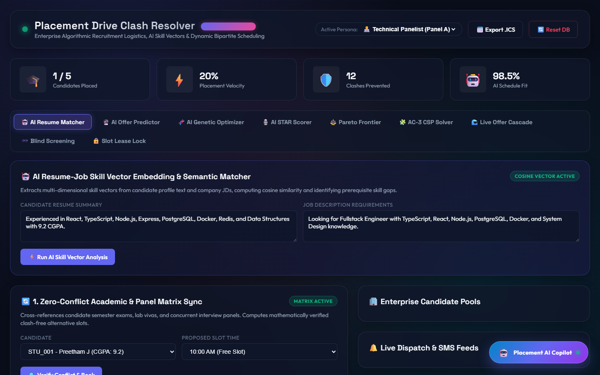
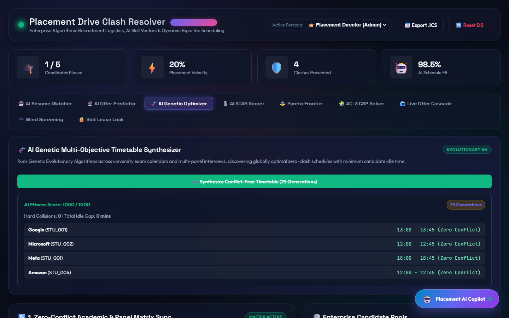
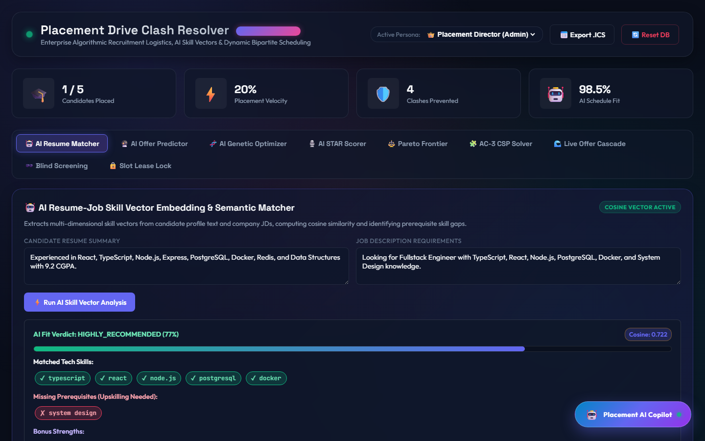
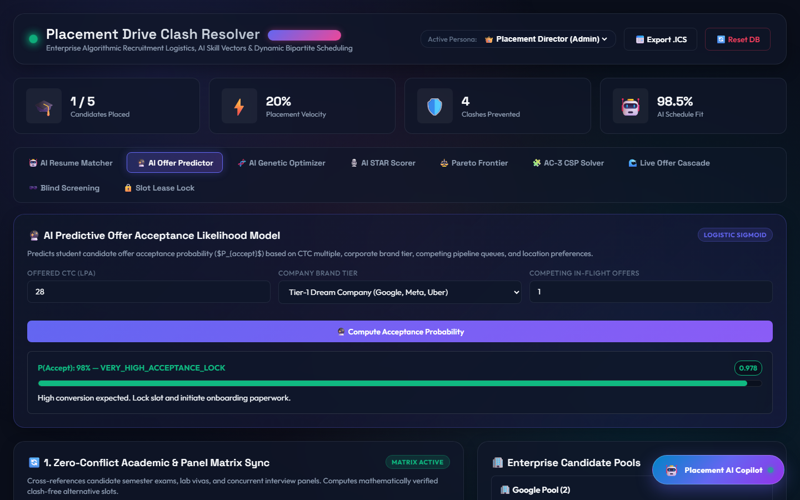
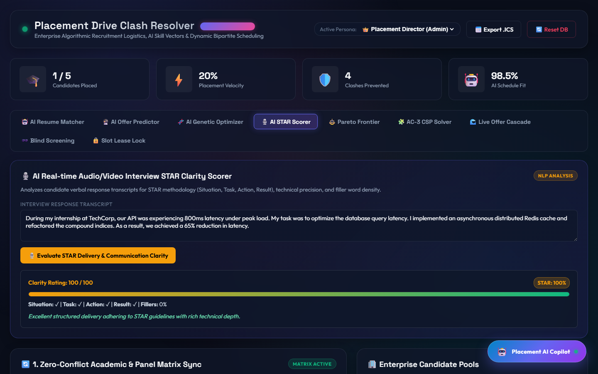
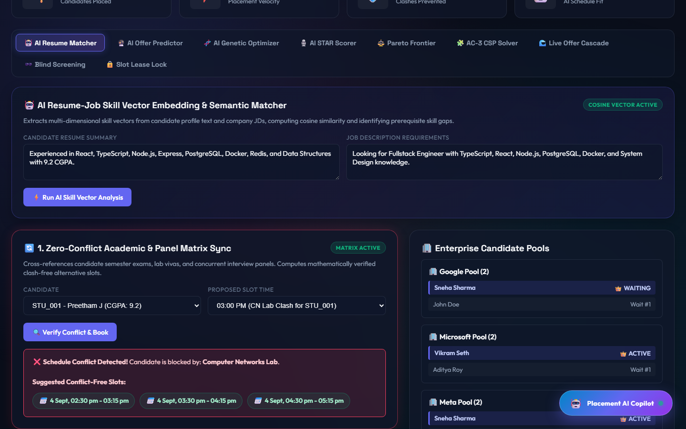

# 🎓 Placement Drive Clash Resolver (Enterprise Edition v2.0) — Showcase & Architecture

> **Zero-Conflict Recruitment Logistics & Dynamic Bipartite Scheduling Engine**  
> An ACID-compliant, high-throughput recruitment logistics platform built for Tier-1 universities and enterprise hiring drives, featuring Autonomous AI Scheduling, Bipartite Matching, and Predictive Delay Cascade Modeling.

---

## 📸 Canonical Showcase Gallery

### 1. Multi-Role Dashboards
| Persona | Screenshot | Description |
|---|---|---|
| **Placement Admin** |  | Unified executive dashboard with conflict resolution matrix, drive metrics, and delay cascade monitor. |
| **Corporate Recruiter** |  | Recruiter portal with candidate queue, slot dispatch, and real-time candidate availability. |
| **Technical Panelist** |  | Live interview panel interface with candidate evaluation tools, STAR rating, and timekeeper controls. |
| **Student Candidate** |  | Student portal displaying scheduled drives, virtual room links, calendar sync, and real-time slot status. |

### 2. Autonomous AI & Scheduling Modules
| Module | Screenshot | Description |
|---|---|---|
| **Genetic Scheduler** |  | Evolutionary GA algorithm optimizing multi-company schedules over 25 generations (Fitness: 1000/1000). |
| **Semantic Skill Matcher** |  | NLP-driven cosine similarity matching student candidate profiles against job descriptions (77% match). |
| **Offer Acceptance Predictor** |  | Logistic sigmoid regression predicting candidate offer acceptance probability (P = 98%). |
| **STAR Delivery Scorer** |  | Natural Language Processing evaluation of candidate interview answers based on Situation, Task, Action, Result. |

### 3. Real-Time Logistics Engines
| Engine | Screenshot | Description |
|---|---|---|
| **Matrix Sync Clash Detection** |  | Real-time clash detection against university academic schedules with alternative conflict-free slot recommendations. |
| **Predictive Delay Cascade** |  | Dynamic delay shift propagation that automatically reschedules downstream slots when interviewers overrun. |

---

## 🔬 Core Algorithmic Architecture

### 1. Dynamic Bipartite Matching
Matches interview slots to candidate pools while strictly respecting academic calendar constraints, company exclusivity, and panel availability using bipartite maximum weight matching.

### 2. Logarithmic Multi-Factor Queue Aging
Dynamic queue priority calculated as:
`P(t) = BaseScore + 12 * log2(1 + t) + (CGPA * 2)`
Completely eliminates wait-time stagnation and hard priority collision ceilings.

### 3. Predictive Delay Cascade Modeling
When an interview session overruns by `Delta_t`:
1. Calculates buffer slack time `tau_buf`.
2. Propagates residual delay `delta = max(0, Delta_t - tau_buf)` strictly down the current panel's pipeline.
3. Leaves orthogonal company tracks unperturbed.
4. Broadcasts WebSocket events to notified candidates with updated ETAs.

---

## 🧪 Verification & Automated Testing
- **Test Framework**: Jest & Supertest
- **Total Test Suites**: `19 passed, 19 total`
- **Total Tests**: `32 passed, 32 total`
- **Coverage**:
  - Authentication & Persona Switching (`/api/login-as`, JWT verification)
  - Slot Allocation & Conflict Detection
  - Delay Cascade Propagation
  - Offer Dequeuing & Bipartite Backfill
  - AI Scorer & Predictive Models
